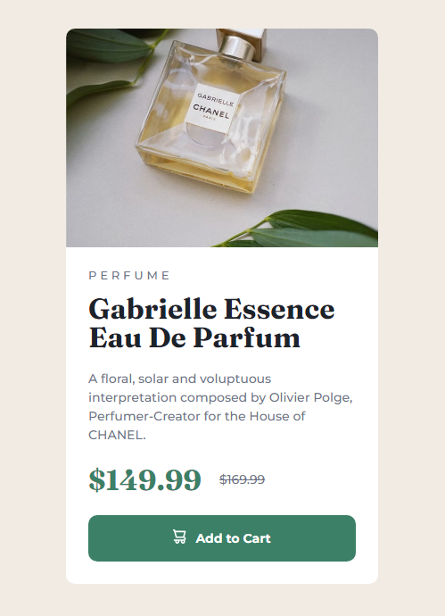

# Frontend Mentor - Product preview card component solution

This is a solution to the [Product preview card component challenge on Frontend Mentor](https://www.frontendmentor.io/challenges/product-preview-card-component-GO7UmttRfa). Frontend Mentor challenges help you improve your coding skills by building realistic projects.

## 📑 Table of contents

- [Overview](#overview)
  - [The challenge](#the-challenge)
  - [Screenshot](#screenshot)
  - [Links](#links)
- [My process](#my-process)
  - [Built with](#built-with)
- [Author](#author)

## Overview

### ⛰️ The challenge

Users should be able to:

- View the optimal layout depending on their device's screen size
- See hover and focus states for interactive elements

### 📷 Screenshot

### Links

- Solution URL: [https://www.frontendmentor.io/solutions/product-preview-card-component-using-css-grid-and-flexbox-vFz_GA-8UZ]
- Live Site URL: [https://perfume-component.netlify.app]

## My process

### 🚀 Built with

This project was built with the following technologies:

- Semantic HTML5 markup and CSS3
- Flexbox
- CSS Grid
- Mobile-first workflow
- Git e Github

## 👨‍💻 Author

- Frontend Mentor - [@DaviSoares-1](https://www.frontendmentor.io/profile/DaviSoares-1)
