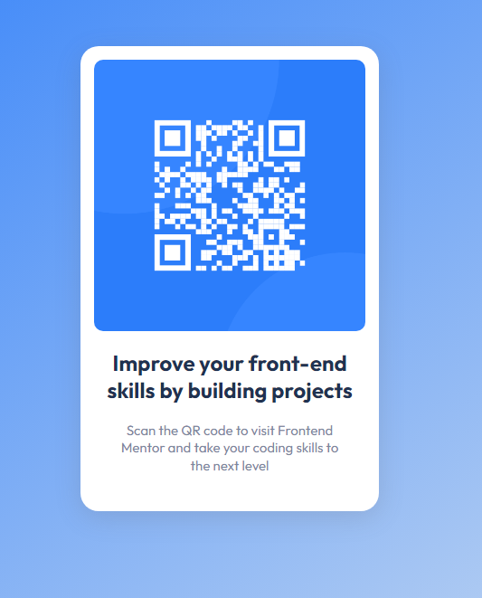

# Frontend Mentor - QR code component solution

This is a solution to the [QR code component challenge on Frontend Mentor](https://www.frontendmentor.io/challenges/qr-code-component-iux_sIO_H). Frontend Mentor challenges help you improve your coding skills by building realistic projects.

## 📑 Table of contents

- [Overview](#overview)
  - [The challenge](#the-challenge)
  - [Screenshot](#screenshot)
  - [Links](#links)
- [My process](#my-process)
  - [Built with](#built-with)
- [Author](#author)

## Overview

### ⛰️ The challenge

A perfect first challenge if you're new to HTML and CSS. The card layout doesn't shift, so it's ideal if you haven't learned about building responsive layouts yet.

### 📷 Screenshot

### 🌐 Links

- Solution URL: 
- Live Site URL: [https://simple-qrcode-card.netlify.app/]

## My process

### 🚀 Built with

- Semantic HTML5 markup and CSS3
- Flexbox
- Mobile-first workflow
- Git e Github

## 👨‍💻 Author

- Frontend Mentor - [@DaviSoares-1](https://www.frontendmentor.io/profile/DaviSoares-1)
