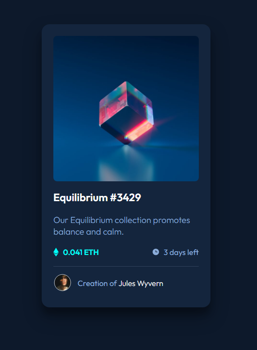

# Frontend Mentor - QR code component solution

This is a solution to the [QR code component challenge on Frontend Mentor](https://www.frontendmentor.io/challenges/qr-code-component-iux_sIO_H). Frontend Mentor challenges help you improve your coding skills by building realistic projects.

## 📑 Table of contents

- [Overview](#overview)
  - [The challenge](#the-challenge)
  - [Screenshot](#screenshot)
  - [Links](#links)
- [My process](#my-process)
  - [Built with](#built-with)
- [Author](#author)

## Overview

### ⛰️ The challenge

This HTML & CSS only challenge is perfect for anyone just starting out or anyone wanting a small project to play around with.

### 📷 Screenshot

### 🌐 Links

- Solution URL: []
- Live Site URL: [https://nft-simple-card.netlify.app/]

## My process

### 🚀 Built with

- Semantic HTML5 markup and CSS3
- Flexbox
- Mobile-first workflow
- Git e Github

## 👨‍💻 Author

- Frontend Mentor - [@DaviSoares-1](https://www.frontendmentor.io/profile/DaviSoares-1)
