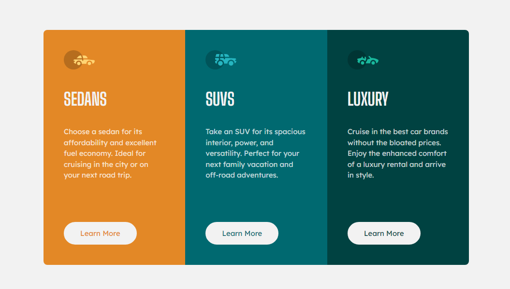

# Frontend Mentor - 3-column preview card component solution

This is a solution to the [3-column preview card component challenge on Frontend Mentor](https://www.frontendmentor.io/challenges/3column-preview-card-component-pH92eAR2-). Frontend Mentor challenges help you improve your coding skills by building realistic projects.

## 📑 Table of contents

- [Overview](#overview)
  - [The challenge](#the-challenge)
  - [Screenshot](#screenshot)
  - [Links](#links)
- [My process](#my-process)
  - [Built with](#built-with)
- [Author](#author)

## Overview

### ⛰️ The challenge

This challenge is perfect if you're just getting started. The shift between the layouts will be a nice test if you're new to building responsive projects.

### 📷 Screenshot

### 🌐 Links

- Solution URL: [https://www.frontendmentor.io/solutions/responsive-3columns-preview-card-using-css3-flex-and-grid-t_-zb6LPkw]
- Live Site URL: [https://3-columns-card-cars.netlify.app/]

## My process

### 🚀 Built with

- Semantic HTML5 markup and CSS3
- Flexbox
- Grid
- Responsive Layout
- Git e Github
- BEM and SMACSS

## 👨‍💻 Author

- Frontend Mentor - [@DaviSoares-1](https://www.frontendmentor.io/profile/DaviSoares-1)
